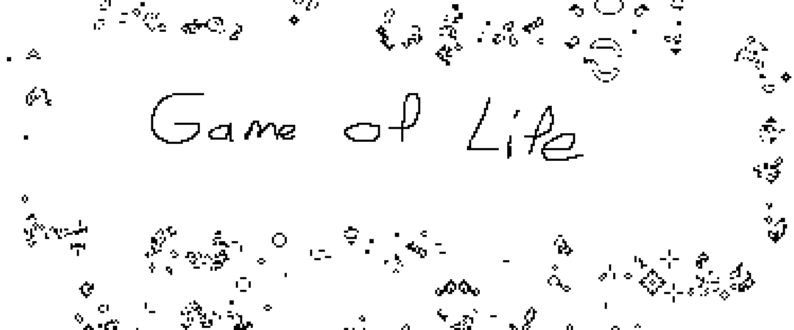

# Conway's Game of Life in C

A simple implementation of Conway's Game of Life written in C using the modern SDL3 library for graphics and input.



---

## About The Project

This project is a clean implementation of Conway's Game of Life. The architecture is designed to be simple and modular, with a clear separation between the core simulation logic and the platform layer (SDL3).

The simulation uses a clever in-place algorithm to calculate the next generation without requiring a second buffer, optimizing memory usage.

### Features

- Classic Conway's Game of Life rules (B3/S23)
- Configurable grid size and window scale
- Rendering via efficient SDL3 Texture Streaming
- Interactive drawing with the mouse to set the initial state
- Pause and resume functionality (Spacebar)
- Makefile-based build system for Linux and other Unix-like systems (including WSL2)
- Editor-aware configuration via `compile_commands.json` for accurate IntelliSense
- Strict and consistent code style enforced by `.clang-format`

### Built With

- [C](<https://en.wikipedia.org/wiki/C_(programming_language)>)
- [SDL3](https://wiki.libsdl.org/)
- [GNU Make](https://www.gnu.org/software/make/)
- [Clang](https://clang.llvm.org/)
- [Bear](https://github.com/rizsotto/Bear)

---

## Getting Started

To get a local copy up and running, follow these steps.

### Prerequisites

A C toolchain, the SDL3 development library, and Bear must be installed.

#### Linux

- **On Arch Linux:**

  ```sh
  sudo pacman -S clang base-devel sdl3 bear
  ```

- **On Debian/Ubuntu or Windows(WSL2):**
  1.  **Install build tools:**
      ```bash
      sudo apt-get update
      sudo apt-get install clang build-essential bear git cmake
      ```
  2.  **Build and install SDL3 from source:**
      ```bash
      git clone https://github.com/libsdl-org/SDL.git
      cd SDL
      mkdir build
      cd build
      CC=clang CXX=clang++ cmake ..
      make
      sudo make install
      sudo ldconfig
      ```

### Building the Project

1.  **Clone the repository:**

    ```bash
    git clone https://github.com/francis1009/game-of-life-c.git
    cd game-of-life-c
    ```

2.  **Generate `compile_commands.json`:**
    This step configures the editor's language server. It only needs to be run once, or whenever source files are added or removed.

    ```bash
    bear -- make debug
    ```

3.  **Build the program:**
    This creates the executable at `bin/game_of_life_debug`.
    ```bash
    make debug
    ```

---

## Usage

The program is run from the command line using the provided `Makefile` targets.

- **Run the simulation:**

  ```bash
  make run-debug
  ```

- **Controls:**
  - **Left Mouse Button (Click and Drag):** Draw live cells on the grid.
  - **Right Mouse Button (Click and Drag):** Erase cells from the grid.
  - **Spacebar:** Pause or resume the simulation.
  - **'c' Key:** Clear the entire grid, resetting it to a blank state.
  - **Escape Key:** Quit the program.

---

## Development

This project uses `clang-format` to maintain a consistent code style. The rules are defined in the `.clang-format` file. If you have a "format-on-save" feature configured in your editor, it will be applied automatically.

---

## Acknowledgments

- **John Horton Conway:** For creating the fascinating cellular automaton that is the Game of Life.
- **The Official SDL Wiki - [wiki.libsdl.org](https://wiki.libsdl.org/):** The primary source of documentation for the SDL3 library, essential for implementing the graphics and input platform layer.
- **In-Place Algorithm:** The simulation logic was adapted from a common and clever algorithm that uses intermediate states to compute the next generation without needing a second buffer.
